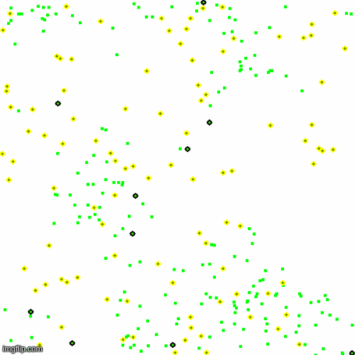

# Evolution-Simulation

Evolution Simulation is a fun project to visualise how organisms evolve according to their environment over a period of time. We have made a simple set of rules as to how the organism may travel, eat, reproduce or die. Every generation has some random variation and the traits of organisms alive are plotted. The Zoo directory contains multiple such environments with variations in rules and organisms type. For instance, the Prey-Predator directory has organisms which are either prey or predator and the graph of their populations over time resembles the corresponding differential equations. More such simulations with different rules are to be added.

# Motivation

This project was inspired by the [Evolution] playlist by [Primer] on Youtube.

# Tech Used

Present code is written in Python 3 and pygames is used to visualize simulation and Matplotlib is used to plot graphs.
#### Libraries used
- numpy
- pygame
- matplotlib
- os (to simplify testing)

# Running the code

```sh
$ git clone https://github.com/Tanmay-Kumar-Sinha/Evolution-Simulation.git
$ cd Evolution-Simulation
$ cd Zoo/
$ ls
```
Now select which simulation you want to run. Let's choose Simple_Ecosystem.
```shhttps://www.youtube.com/channel/UCKzJFdi57J53Vr_BkTfN3uQ
$ cd Simple_Ecosystem/
$ python3 simulation.py
```
A pygame window will pop up and the simulation begins. Many variables that can be tweaked are present in simulation.py. Feel free to modify and experiment with them. Each simulation has certain features that we are plotting w.r.t. time and the details can be found in their corresponding folders.

# Contribute

We will be glad to receive support and new ideas from our visitors. If you find any problem/bug in the code, feel free to raise an issue and/or a pull request after resolving it. Given that this is a fun project, all creative ideas are welcome. We have also listed some of the ideas with "enhancement" tag in issues.

# How does it look #
below are some gifs to show how the code actually looks when it runs... these gifs might nor be up to date.

### Simple Ecosystem ###


### Prey-Predator Ecosystem ###


### Prey-Predator with sense of surroundings ###


### Prey-Predator with sense (using neural networks) of surroundings ###


# Team
- [Tanmay Kumar Sinha][tks]
- [Chaitanya Kharyal][ck]
- [Yash Chaurasia][yc]

# License

MIT License


[Evolution]: https://www.youtube.com/playlist?list=PLKortajF2dPBWMIS6KF4RLtQiG6KQrTdB
[Primer]: https://www.youtube.com/channel/UCKzJFdi57J53Vr_BkTfN3uQ
[tks]: https://github.com/Tanmay-Kumar-Sinha
[ck]: https://github.com/kharyal
[yc]: https://github.com/Y5Yash
